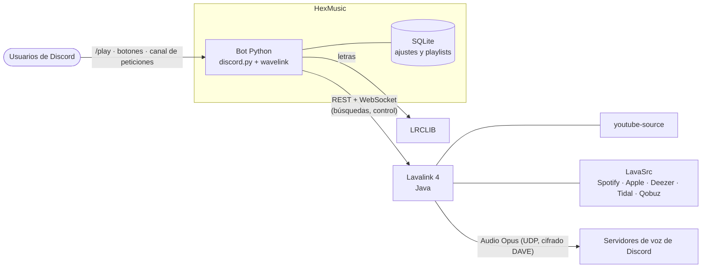
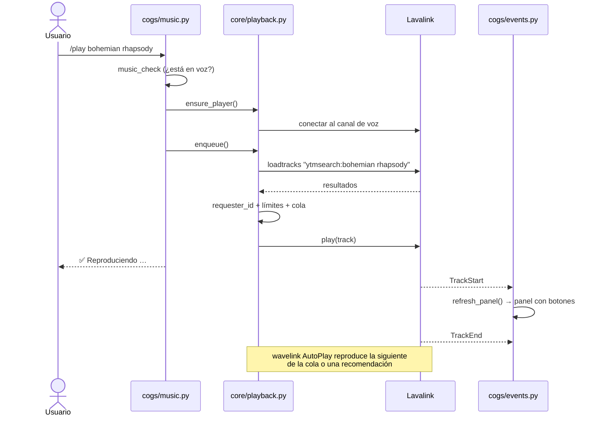

# 🧱 Arquitectura

## Visión general

**¿Por qué dos procesos?** Procesar audio en Python es lento y se lleva mal con el resto del bot. Lavalink (Java) decodifica y codifica el audio y lo envía por UDP con alto rendimiento. El bot solo le da órdenes: "busca esto", "reproduce aquella pista", "pausa". Así el bot va ligero, un Lavalink puede atender cientos de reproductores y se pueden añadir más nodos para escalar.

---

## Mapa de módulos

| Módulo | Responsabilidad |
|---|---|
| `__main__.py` | Carga `.env` y `config.yml`, configura los logs y arranca el bot |
| `bot.py` | Clase `HexMusic`: arranque, conexión a Lavalink, sincronización de slash, idiomas, permisos DJ y gestión de errores |
| `config.py` | Valores por defecto, fusión con `config.yml`, expansión de `${VARIABLES}` y validación |
| `database.py` | SQLite asíncrono: `guild_settings`, `playlists`, `playlist_tracks`, con caché de ajustes |
| `i18n.py` | `I18n` (mensajes) y `HexTranslator` (descripciones de los comandos slash) |
| `player.py` | `HexPlayer` (hereda de `wavelink.Player`): votos, 24/7, canción anterior, filtros, panel |
| `checks.py` | `music_check()`: validaciones de voz, reproductor y DJ |
| `errors.py` | `HexError`: errores con clave de traducción |
| `core/playback.py` | Búsqueda, conexión, cola, autoplay y votaciones. Lo comparten comandos, botones y canal de peticiones |
| `core/panel.py` | Crear o actualizar el panel "reproduciendo ahora" |
| `core/presets.py` | Presets de filtros y conversión al formato de Lavalink |
| `ui/embeds.py` | Todos los embeds, con el branding de la configuración |
| `ui/views.py` | `ControlsView` (botones persistentes), `Paginator` y `SearchView` |
| `utils/` | Formato de tiempos y barras, búsqueda de letras |
| `cogs/music.py` | Comandos de reproducción y cola |
| `cogs/filters.py` | Comandos de filtros |
| `cogs/playlists.py` | Comandos de playlists |
| `cogs/settings.py` | `/settings`, `/setup`, `/unsetup` |
| `cogs/general.py` | `/help`, `/ping`, `/stats`, `/invite` y comandos de dueño |
| `cogs/events.py` | Eventos de Lavalink y Discord: panel, inactividad, canal vacío, 24/7 y canal de peticiones |
| `web/server.py` | Servidor aiohttp del panel web: rutas, login, cabeceras de seguridad y errores |
| `web/auth.py` | OAuth2 de Discord, sesiones (hash en la base de datos) y permisos por servidor |
| `web/api.py` | API JSON: estadísticas, reproductor, ajustes y playlists (reutiliza `core/`) |
| `web/static/` | Interfaz del panel (HTML, CSS y JavaScript sin dependencias ni compilación) |
| `console.py` | Comandos escritos en la consola (stdin) para paneles de hosting |

---

## Flujo de `/play`

---

## Estado y persistencia

| Dato | Dónde vive | ¿Sobrevive a un reinicio? |
|---|---|---|
| Cola, canción actual, filtros, votos | Memoria (`HexPlayer`) | No |
| Idioma, prefijo, rol DJ, volumen, votaciones, anuncios, autoplay | SQLite `guild_settings` | Sí |
| Modo 24/7 y su canal | SQLite `guild_settings` | Sí (el bot vuelve a entrar al arrancar) |
| Canal de peticiones y mensaje del panel | SQLite `guild_settings` | Sí (los botones siguen funcionando) |
| Playlists | SQLite `playlists` + `playlist_tracks` | Sí |

Las canciones de las playlists se guardan con los datos codificados de Lavalink (`encoded`). Así se cargan al instante sin volver a buscarlas.

---

## Decisiones de diseño

- **Comandos híbridos:** una sola implementación sirve para `/slash` y para el prefijo.
- **Lógica fuera de los comandos:** `core/playback.py` la comparten los comandos, los botones y el canal de peticiones, así que se comportan igual.
- **Errores traducibles:** el código lanza `HexError("clave")` y un único manejador lo traduce y responde. No hay textos sueltos en el código.
- **`None` = valor por defecto:** en los ajustes de servidor, `None` significa "usar `config.yml`". Cambiar la configuración global afecta a todos los servidores que no la hayan personalizado.
- **Conexión a Lavalink en segundo plano:** el bot arranca aunque Lavalink tarde, y wavelink reconecta automáticamente con espera exponencial.
