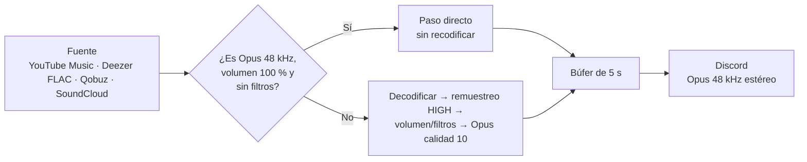

# 🎧 Calidad de audio

## Lo que hay que saber primero

Discord transmite **todo** el audio de voz en **Opus a 48 kHz estéreo**. Ningún bot puede enviar FLAC ni audio "Hi-Res" sin pérdida hasta el oyente. La calidad final depende de tres cosas:

1. **La fuente:** una pista oficial o sin pérdida suena mejor que un videoclip subido varias veces.
2. **Cuántas veces se recodifica** el audio antes de llegar a Discord. Cada codificación con pérdida degrada un poco.
3. **Estabilidad:** si al servidor le falta CPU o tiene la red saturada, hay cortes y pérdida de paquetes.

HexMusic está configurado para optimizar las tres.

---

## Cómo viaja el audio

- **Paso directo:** YouTube y YouTube Music ofrecen audio Opus. Si el volumen está al 100 % y no hay filtros, Lavalink envía los paquetes originales **sin decodificarlos ni recodificarlos**. Es la máxima fidelidad posible con esa fuente y además apenas usa CPU.
- **Recodificación:** con cualquier otra fuente (FLAC, MP3, AAC), o si cambias el volumen o aplicas filtros, Lavalink decodifica el audio, lo procesa y lo vuelve a codificar. Para ello usa el remuestreador y el codificador Opus en su calidad máxima.

---

## Ajustes aplicados en `lavalink/application.yml`

| Ajuste | Valor | Por qué |
|---|---|---|
| `opusEncodingQuality` | `10` | Máxima calidad del codificador Opus (0-10) |
| `resamplingQuality` | `HIGH` | Remuestreo sin artefactos, p. ej. al pasar de 44,1 kHz a 48 kHz |
| `frameBufferDurationMs` | `5000` | 5 s de audio preparado: absorbe picos de red o de CPU |
| `bufferDurationMs` | `400` | Búfer nativo (JDA-NAS) resistente a pausas de la JVM |
| `nonAllocatingFrameBuffer` | `false` | Cambios de volumen y filtros instantáneos |
| `useSeekGhosting` | `true` | Sigue sonando mientras se procesa un salto en la canción |
| `trackStuckThresholdMs` | `10000` | Detecta pistas atascadas y las salta |
| Deezer `formats` | `FLAC` primero | La mejor fuente disponible |

Y en `config.yml`:

| Ajuste | Valor | Por qué |
|---|---|---|
| `lavalink.default_search` | `ytmsearch` | YouTube Music devuelve pistas de audio oficiales, no videoclips |
| `player.default_volume` | `100` | Permite el paso directo sin recodificar |

---

## ✅ Lista para la máxima calidad

1. **Volumen al 100 % y sin filtros** mientras escuchas música "en serio". `/filter reset` y `/volume 100`.
2. **Busca en YouTube Music** (predeterminado) o pega enlaces de Spotify, Apple Music o Tidal: LavaSrc los resuelve por ISRC a la grabación exacta.
3. **Añade una fuente sin pérdida** (Deezer premium o Qobuz) y ponla la primera en `providers` (ver [Fuentes](FUENTES.md#qué-es-espejo-mirroring)). Así los enlaces de Spotify, Apple Music y Tidal salen de un máster FLAC codificado **una sola vez** a Opus calidad 10.
4. **Aloja Lavalink cerca de Discord.** Un servidor en la misma región que tus oyentes (p. ej. Europa para España) reduce la latencia y el jitter.
5. **Dale CPU real a Lavalink.** Evita VPS con CPU compartida muy saturada. Cada reproductor que recodifica usa CPU de forma continua.
6. **Reserva memoria suficiente** (`LAVALINK_MEMORY=1G` o más). Si la JVM se queda sin memoria, hace pausas de recolección que provocan cortes. En el log aparecen como *GC warnings*.
7. **Mantén actualizados** Lavalink y los plugins.

---

## Diagnóstico de cortes

| Síntoma | Causa probable | Solución |
|---|---|---|
| Cortes periódicos en todos los servidores | CPU al límite | Más CPU, menos filtros o más nodos |
| Cortes y avisos de GC en el log | Poca memoria para la JVM | Sube `LAVALINK_MEMORY` |
| Cortes solo en algunos servidores | Distancia a la región de voz de Discord | Mueve Lavalink o añade un nodo cercano |
| Una canción concreta se para | Fuente con problemas | El bot la salta sola; prueba otra versión |
| Robotización o sonido metálico | Pérdida de paquetes en la red del host | Cambia de proveedor o de ubicación |

`/stats` muestra la carga de CPU y la memoria de cada nodo de Lavalink.
